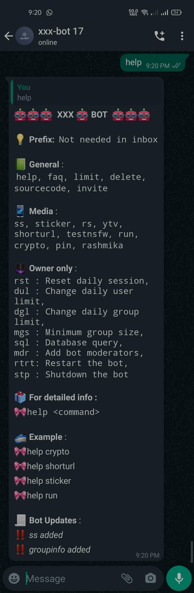
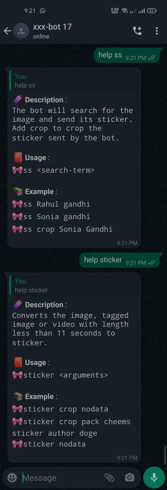
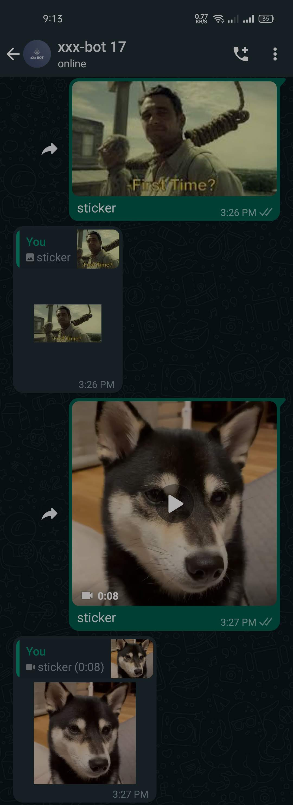
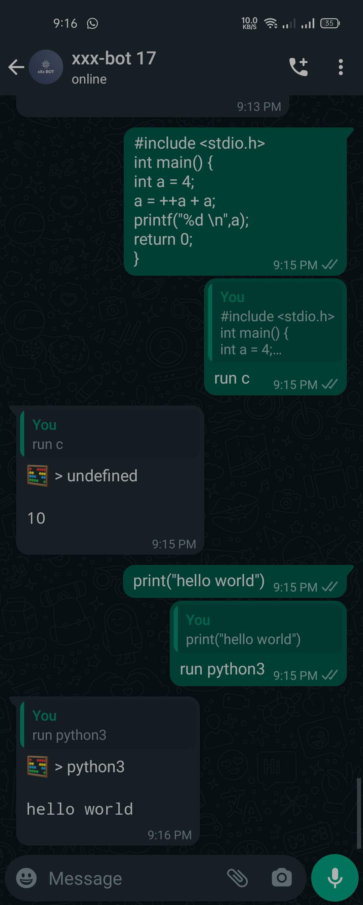

<h1 align="center">🤖 No Longer Maintained!🤖</h1>

<h1 align="center">🤖 AKM WHATSAPP BOT 🤖</h1>

<h2 align="center">🤖 <a href="/docs/heroku-hosting.md">Click here to get your personal bot</a> 🤖</h1>

#### 💻 Or test on your computer [Guide](/docs/self-hosting.md)

## 📝 Features

<table>
  <tr>
    <td> </td>
     <td> </td>
     <td> </td>
  </tr>
  <tr>
    <td></td>
    <td></td>
    <td></td>

  </tr>
   <tr>
    <td></td>
    <td></td>
    <td></td>

  </tr> <tr>
    <td></td>
    <td></td>
    <td></td>

  </tr>
 </table>

## 💪 Contribution

- Feel free to open issues regarding any problems or if you have any feature requests
- Make sure to enter proper documentation before opening PRs

## 💡 How to use the bot

- Send `hi` to the bot in the inbox to see if the bot is working.
- or hi along with prefix if in a group.
- The bot will respond with `👋 hello`.
- Send `help` to the bot in the inbox or help along with prefix if in a group.
- The bot will respond with the menu.

## 🔧 Default Configuration

- Default daily limit for a normal user is `70` messages.
- Owner and bot moderators have no limit and they cannot be banned in groups.
- Owner and bot moderators have access to all group commands even if they are not admin in any group.
- Default daily group limit is `100` messages.
- By default, abuse detection and nudity detection is on.
- Default minimum group size for the bot to work in it is `1` members.
- These values can be changed only by the bot owner.
- When the bot is added to any group, it will auto assign any random prefix to it, which can be changed by group admins using `setprefix` command or prefix can be turned off using `prefix` command.
- If deepai api key is added to the bot, the bot will detect nudity in the image and if it detects 50% nudity, it will not make a sticker.

## ⚠️ Troubleshooting

##### 1. The bot is not responding to anyone

- Make sure you have the latest version of the bot, to get it click on fetch upstream on your forked github repo.
- Send the command `rtrt` to restart the bot.
- Go to to the bot website and click on the `restart` button.
- See heroku logs and see if it is showing connected and bot name or not.
- If not try logging out using the bot website and login again.

##### 2. The bot is not responding to a particular user

- The user might have used the daily limit.
- If so, the limit will be reset at `00:00` every day.
- The user might have been blocked by the bot if it is not replying in a group.
- type `banlist` in a group to see the list of banned users.

##### 3. The bot is not responding to a particular group

- The group may be admins only.
- The users may not be using the correct prefix.
- Try `.hi` , `!hi` , `#hi` or `-hi` to see if the bot responds to any of them.
- If the bot is not responding to any of the above prefixes, then send `hi` to see if the prefix is disabled for that group.
- The bot may be down due to heavy traffic.
- Try after some time.
- Open an issue if the problem persists.

##### 4. Other troubles

- Make sure the env variables are set properly.
- Make sure the phone is connected to the internet.
- Make sure the Heroku postgres is added in the addons if running on heroku or the database uri is set properly if running locally.

## 📜 Documentation

- you are on your own....
