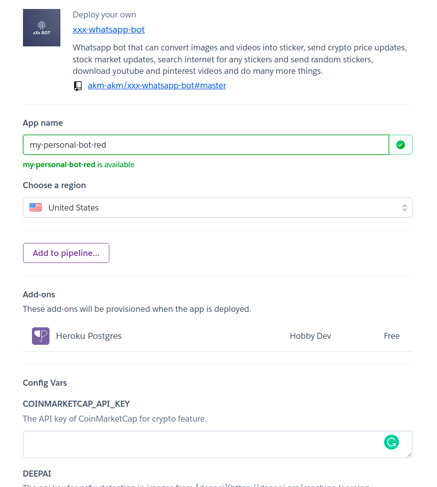
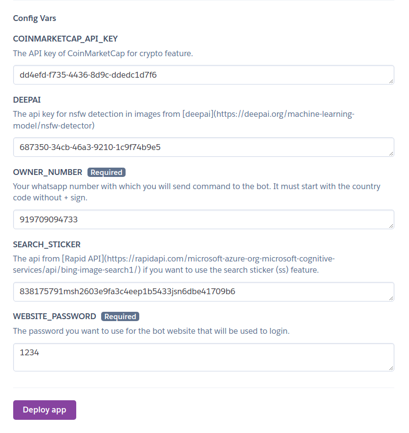

# 🤖️ Heroku Deployment Guide 🤖️

## 🎅 Just right click on the button below and open in a new tab

### The following site will open in a new tab -

  </img>

- Enter a unique App name in the field above

- Leave the region to United States

#### Now scroll down to config vars -

  </img>
### 🔑 Fill this form with APIs of the features you need.

- `COINMARKETCAP_API_KEY` The API key of [CoinMarketCap](https://pro.coinmarketcap.com/signup) for crypto market data. (optional)

- `DEEPAI` The api key for nsfw detection in images from [deepai](https://deepai.org/machine-learning-model/nsfw-detector). (optional)

- `OWNER_NUMBER` Your whatsapp number along with country code without + sign. (required)

- `SEARCH_STICKER` The api from [Rapid API](https://rapidapi.com/microsoft-azure-org-microsoft-cognitive-services/api/bing-image-search1/) if you want to use the search sticker (ss) feature. (optional)

- `WEBSITE_PASSWORD` The password you want to keep for the bot website. (required)

##### After filling the required APIs click on deploy app

##### Now the bot will be deployed in under a minute and then click on view button

### ‼️ Failing to do the below step will stop the bot from working

- Since heroku uses Dyno sleeping in which if an app has a free web dyno, and that dyno receives no web traffic in a 30-minute period, it will sleep. In addition to the web dyno sleeping, the worker dyno (if present) will also sleep. and if a sleeping web dyno receives web traffic, it will become active again after a short delay (assuming your account has free dyno hours available) You can use [Cron job](https://console.cron-job.org) to ping the heroku app every 30 minutes to prevent it from sleeping. Heroku will stop the bot if the website does not receive any traffic.
- Create an account on [cron job](https://console.cron-job.org/signup).
- Create a [new job](https://console.cron-job.org/jobs/create), fill the title and url of the bot and and keep the execution schedule to 15 minute.
- Now click on create button.
- The bot will be ping every 15 minutes and it will never sleep(for 550 Hour which is the limit per month).

## 🤖 Running

- The website will open in your browser. Login using the password you entered in the previous step.
  </img>
- Click on start and scan the qr code shown on the website using the WA-Web Scanner on your WhatsApp.
  </img>
- On successful login you will see connected written on the button.
  </img>
- Now close the browser.

## 💡 How to use the bot

- Send `hi` to the bot in the inbox or hi along with prefix if in a group.
- The bot will respond with `👋 hello`.
- Send `help` to the bot in the inbox or help along with prefix if in a group.
- The bot will respond with the menu.

## 🔧 Default Configuration

- Default daily limit for a normal user is `70` messages.
- Owner and bot moderators have no limit and they cannot be banned in groups.
- Owner and bot moderators have access to all group commands even if they are not admin in any group.
- Default daily group limit is `100` messages.
- By default, abuse detection and nudity detection is on.
- Default minimum group size for the bot to work in it is `1` members.
- These values can be changed only by the bot owner.
- When the bot is added to any group, it will auto assign any random prefix to it, which can be changed by group admins using `setprefix` command or prefix can be turned off using `useprefix` command.
- If deepai api key is added to the bot, the bot will detect nudity in the image and if it detects 50% nudity, it will not make a sticker.

### 🔗 Want to test on you computer? Click [here](self-hosting.md)
