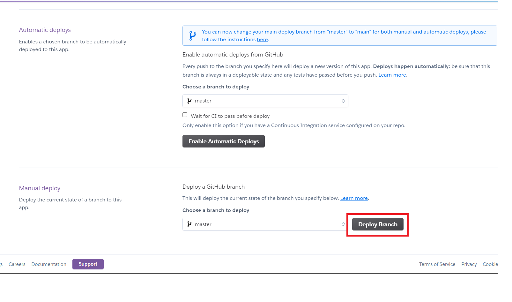

# 🤖️ Heroku Deployment Guide 🤖️

## ⛵ Pre-requisite

- 🌐️ Internet 🌐️️
- 🧠️ Brain 🧠️
- 🎵️ Music 🎵️

## 🍀 Deployment

- Fork this repository.
- Create an account [Heroku](https://signup.heroku.com/login).
- Create a [new app](https://dashboard.heroku.com/new-app).
- Now select github under deployment method.
 <br/></img>
- input xxx-whatsapp-bot and search and connect the repo displayed.
- now under resources tab select add addons.
 <br/></img>
- Search heroku postgres and click on the result.
- Then click on submit order form on the pop up.
- Now under settinngs tab click on reveal config vars.
 <br/></img>
- Now under config vars input the values shown in `.env.example`.
 <br/></img>

```env
COINMARKETCAP_API_KEY=
KEEPSAVEIT_API=
clientId=
clientSecret=
OWNER_NUMBER=
HOSTING_PLATFORM=
WEBSITE_PASSWORD=
DEEPAI=
SEARCH_STICKER=
CHATBOT_API=
```

`COINMARKETCAP_API_KEY` The API key of CoinMarketCap for crypto market data. (optional)

`KEEPSAVEIT_API` The API key of KeepSaveIt for downloading the Pinterest videos. (optional)

`clientId` The client id from jdoodle.com for the run feature to compile code. (optional)

`clientSecret` The client secret from jdoodle.com for the run feature to compile code. (optional)

`OWNER_NUMBER` Your whatsapp number along with country code without + sign. (required)

`HOSTING_PLATFORM` Add heroku there. (required)

`WEBSITE_PASSWORD` The password you want to keep for the bot website. (required)

`DEEPAI` The api key for nsfw detection in images from deepai.org. (optional)

`SEARCH_STICKER` The api from [Rapid API](https://rapidapi.com/microsoft-azure-org-microsoft-cognitive-services/api/bing-image-search1/) if you want to use the search sticker (ss) feature. (optional)

`CHATBOT_API` The api key from [Rapid API](https://rapidapi.com/lemur-engine-lemur-engine-default/api/harley-the-chatbot) for the chatbot to work in the inbox. (optional)

- Now click on Deploy tab and scroll to the bottom and click on deploy.
 <br/></img>
- Now the bot will be deployed in under a minute.

# ‼️‼️ FAiling to do the below step will stop the bot from working

- Since heroku uses Dyno sleeping in which if an app has a free web dyno, and that dyno receives no web traffic in a 30-minute period, it will sleep. In addition to the web dyno sleeping, the worker dyno (if present) will also sleep. and if a sleeping web dyno receives web traffic, it will become active again after a short delay (assuming your account has free dyno hours available) You can use [Cron job](https://console.cron-job.org) to ping the heroku app every 30 minutes to prevent it from sleeping. Heroku will stop the bot if the website does not receive any traffic.
- Create an account on [cron job](https://console.cron-job.org/signup).
- Create a [new job](https://console.cron-job.org/jobs/create), fill the title and url of the bot and and keep the execution schedule to 15 minute.
- Now click on create button.
- The bot will be ping every 15 minutes and it will never sleep(for 550 Hour which is the limit per month).

## 🤖 Running

- Now click on view.
 <br/></img>
- The website will open in your browser. Login using the password you entered in the previous step.
 <br/></img>
- Click on start and scan the qr code shown on the website using the WA-Web Scanner on your WhatsApp.
 <br/></img>
- On successful login you will see connected written on the button.
 <br/></img>
- Now close the browser.

### 🔗 Want to test on you computer? Click [here](self-hosting.md)